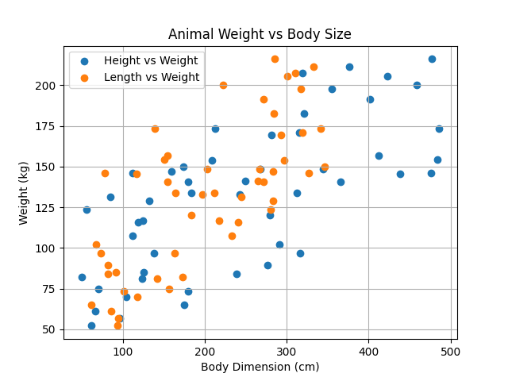

# Animal Weight Predictor

This project uses a simple machine learning model (linear regression) to predict the weight of an animal based on its height and length. It generates synthetic data for six different animals: Cat, Dog, Panda, Giraffe, Gorilla, and Zebra.

---

## Project Features

- Creates a random dataset of animal body measurements
- Trains a linear regression model using scikit-learn
- Predicts the weight of a new animal using height and length
- Visualizes body size vs weight using a scatter plot

---

## File Structure
animal.py # Main Python script
README.md # Project overview and instructions
Figure_1.png # Plot image generated by the script

## Requirements
Install these Python packages using pip:
```bash
pip install pandas numpy matplotlib scikit-learn
```

## Sample Output Plot

This chart shows the relationship between body dimensions and predicted animal weight.


